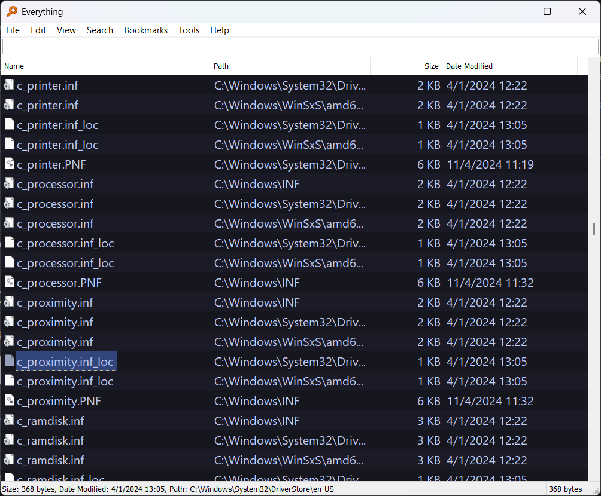

## Tokyo Night for Everything

This repository contain the Tokyo Night color scheme for Everything. ***Mind that it will also override your preferences with the ones in the repository***.

## Installation

We can install the theme by copying the `Everything.ini` file into the Everything's installation directory. If you can't find the directory, simply use Everything to search for `Everything.ini` and open the resulting directory in a file manager.

## Contribute

Feel free to contribute enhacenments.
